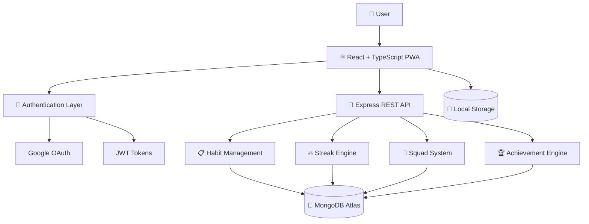

# ⚛️ Atomiq

### Build Better Habits. Stay Consistent. Track Progress.


---

## 📖 Overview

Atomiq is a full-stack Progressive Web Application (PWA) designed to help users build lasting habits through consistency, accountability, and progress tracking.

The platform combines habit management, streak systems, social accountability, and gamification to make personal growth engaging and sustainable.

Whether you're trying to build a new habit, break a bad one, or stay accountable with friends, Atomiq provides the tools to stay on track.

---

## ✨ Key Features

### 📋 Habit Management

* Create and manage custom habits
* Daily and weekly scheduling
* Duration-based challenges
* Micro-habit support
* Completion history tracking

### 🔥 Streak System

* Visual streak counters
* Progress tracking
* Streak recovery logic
* Consistency monitoring
* Daily completion indicators

### 🏆 Gamification

* XP-based progression
* Achievement badges
* Milestone rewards
* Habit completion incentives

### 🤝 Social Squads

* Create or join accountability groups
* Friend invite system
* Shared progress tracking
* Community-driven motivation

### 📱 Progressive Web App

* Installable on mobile and desktop
* Offline support
* Fast loading experience
* Native-app-like interface

### 🎨 Modern User Experience

* Responsive design
* Dark/Light themes
* Smooth animations
* Glassmorphism-inspired UI
* Mobile-first experience

---

## 🏗️ System Architecture



---

## 🛠️ Tech Stack

### Frontend

* React
* TypeScript
* Vite
* Tailwind CSS
* Framer Motion
* Lucide React

### Backend

* Node.js
* Express.js

### Database

* MongoDB Atlas
* Mongoose

### Authentication

* JWT Authentication
* Passport.js
* Google OAuth 2.0

### Additional Technologies

* Progressive Web App (PWA)
* Local Storage
* REST APIs
* Responsive Design

---

## 📂 Project Structure

```text
Atomiq
│
├── public/
│
├── src/
│   ├── components/
│   ├── pages/
│   ├── contexts/
│   ├── hooks/
│   ├── services/
│   └── assets/
│
├── server/
│   ├── routes/
│   ├── controllers/
│   ├── middleware/
│   ├── models/
│   ├── config/
│   └── utils/
│
├── screenshots/
│
├── README.md
├── package.json
└── vite.config.ts
```

---

## 🚀 Getting Started

### Prerequisites

* Node.js (v16 or later)
* MongoDB Atlas or Local MongoDB Instance

### Installation

Clone the repository:

```bash
git clone https://github.com/user-Gyrus/Atomiq.git
```

Install frontend dependencies:

```bash
npm install
```

Install backend dependencies:

```bash
cd server
npm install
```

---

## ⚙️ Environment Configuration

Create a `.env` file inside the `server/` directory:

```env
NODE_ENV=development
PORT=5000

DATABASE_URL=your_mongodb_connection_string

JWT_SECRET=your_jwt_secret

SESSION_SECRET=your_session_secret

CLIENT_URL=http://localhost:5173

GOOGLE_CLIENT_ID=your_google_client_id

GOOGLE_CLIENT_SECRET=your_google_client_secret

GOOGLE_CALLBACK_URL=http://localhost:5000/api/auth/google/callback
```

---

## ▶️ Running the Application

Start frontend and backend concurrently:

```bash
npm run dev
```

Application URLs:

Frontend:

```text
http://localhost:5173
```

Backend:

```text
http://localhost:5000
```

---

## 📱 PWA Installation

### Android

1. Open Atomiq in Chrome
2. Tap Menu
3. Select "Add to Home Screen"

### iOS

1. Open Atomiq in Safari
2. Tap Share
3. Select "Add to Home Screen"

---

## 🎯 Learning Outcomes

This project provided practical experience with:

* Full-Stack Application Development
* REST API Design
* JWT Authentication
* OAuth Integration
* MongoDB Data Modeling
* Progressive Web Applications
* Responsive UI Design
* Deployment & Production Workflows

---

## 🚀 Future Roadmap

* 🔔 Smart Habit Reminders
* 📈 Advanced Analytics Dashboard
* 🏆 Expanded Achievement System
* 🤖 AI-Based Habit Recommendations
* 📊 Weekly Progress Reports
* 👥 Enhanced Social Features
* 📅 Calendar Integrations

---
## 👨‍💻 Developer

Nanda Kumar

Software Engineer | Full-Stack Developer

GitHub: https://github.com/user-Gyrus

LinkedIn: https://www.linkedin.com/in/nanda-kumar-balaji-483a38255/

Portfolio: https://my-portfolio-2204.netlify.app/

---

## 🎨 Design Credits

UI/UX design and product ideation created in collaboration with Bala Hari Krishna.

---

⭐ If you found this project interesting, consider giving it a star.
